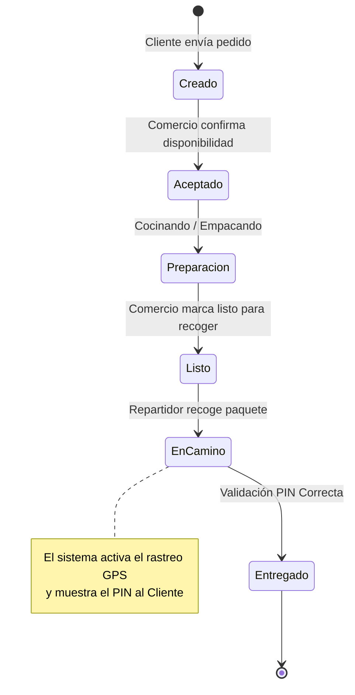
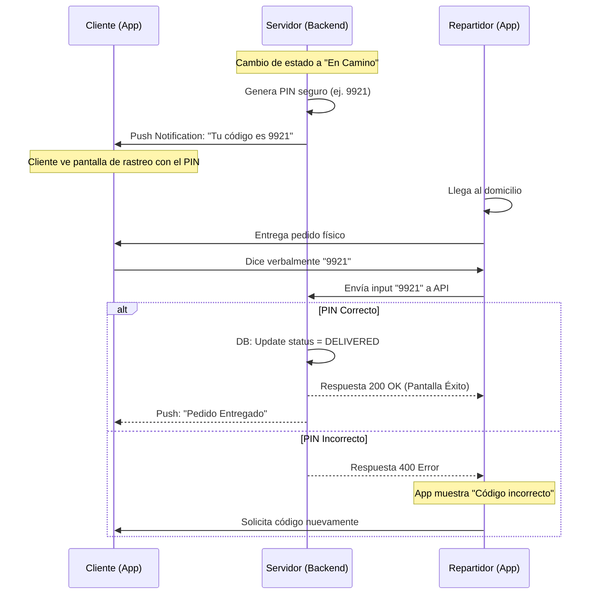
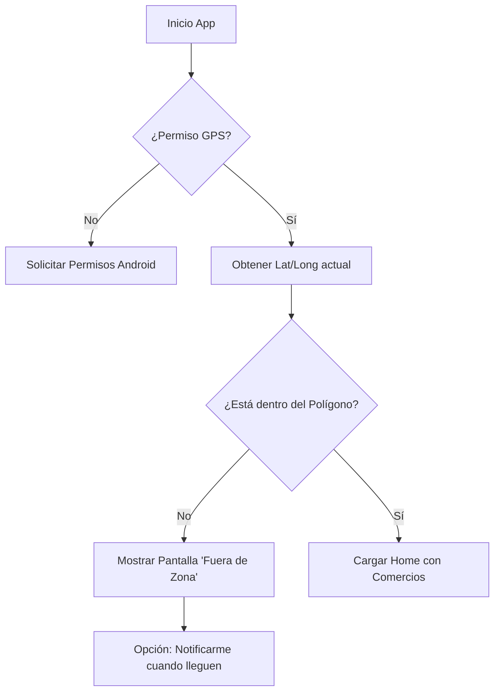

# Diagramas de Flujo y Procesos

Este documento define la lógica visual del sistema. Se utiliza sintaxis Mermaid.js compatible con la mayoría de visores de Markdown modernos (GitLab, GitHub, Obsidian).

## 1. Ciclo de Vida del Pedido (Happy Path)

Estados por los que pasa un pedido desde la intención de compra hasta la entrega.

## 2. Flujo Crítico: Seguridad de Entrega (PIN)

Detalle de la interacción Cliente-Repartidor-Servidor para cerrar la transacción.

## 3. Flujo de Validación Geográfica (Geofencing)

Lógica para determinar si se puede prestar el servicio.

